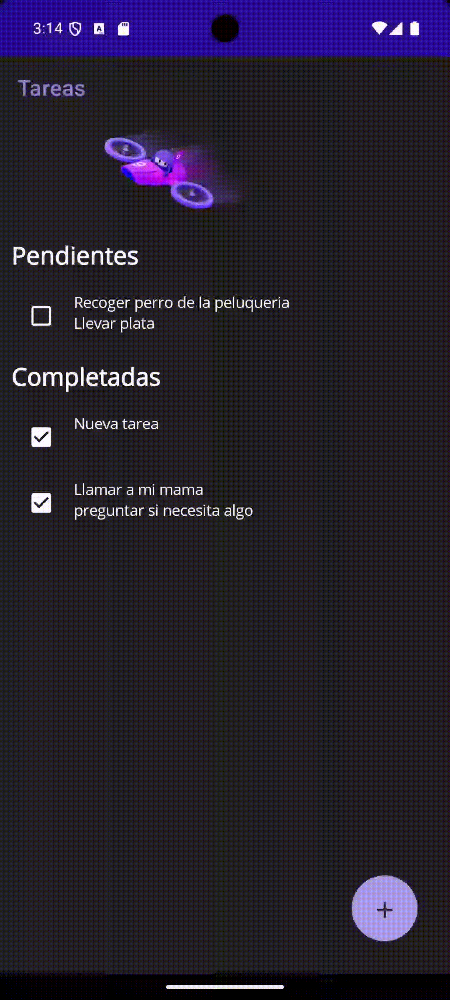

# TodoApp

A simple cross-platform To-Do list application built with .NET MAUI.

This application allows users to manage their daily tasks, add new ones, mark them as complete, and delete them. The tasks are grouped into "Pending" and "Completed" sections.

## Demo

*You can install the apk inside the demo folder*



## Features

-   **Create Tasks:** Add new tasks to your to-do list.
-   **View Tasks:** See all your tasks, neatly organized.
-   **Group Tasks:** Tasks are automatically grouped into "Pending" and "Completed" lists.
-   **Update Status:** Mark tasks as completed or re-open them.
-   **Delete Tasks:** Remove tasks you no longer need.
-   **Local Storage:** Your tasks are saved locally on your device using a SQLite database.
-   **Dark/Light Mode:** The app supports dark and light mode.

## Technologies Used

-   **.NET MAUI:** A cross-platform framework for creating native mobile and desktop apps with C# and XAML.
-   **.NET 9:** The underlying platform.
-   **C#:** The programming language used.
-   **XAML:** Used for defining the user interface.
-   **MVVM (Model-View-ViewModel):** The architectural pattern used to structure the code, facilitated by the [CommunityToolkit.Mvvm](https://www.nuget.org/packages/CommunityToolkit.Mvvm) library.
-   **SQLite:** For local database storage, using the [sqlite-net-pcl](https://www.nuget.org/packages/sqlite-net-pcl) library.
-   **Dependency Injection:** Used to manage dependencies throughout the application.

## Getting Started

### Prerequisites

-   [.NET 9 SDK](https://dotnet.microsoft.com/download/dotnet/9.0)
-   .NET MAUI workload installed. You can install it by running the following command:
    ```sh
    dotnet workload install maui
    ```
-   An IDE like Visual Studio 2022 or Visual Studio Code with the .NET MAUI extension.

### How to Run

1.  **Clone the repository:**
    ```sh
    git clone https://github.com/jimibilibob/todo-app
    ```
2.  **Open the solution:**
    Open the `TodoApp.sln` file in Visual Studio.
3.  **Restore dependencies:**
    The dependencies should restore automatically. If not, build the project to trigger the restore.
4.  **Run the application:**
    Select your target platform (Android, iOS, Windows) and run the application.

## Project Structure

-   `TodoApp/`: The main .NET MAUI project.
    -   `Data/`: Contains the database logic (`Database.cs`).
    -   `Models/`: Contains the data models, like the `TodoEntity`.
    -   `ViewModels/`: Contains the ViewModels for the MVVM pattern.
    -   `Views/` (XAML files): The UI pages of the application (`MainPage.xaml`, `TaskCreationPage.xaml`).
    -   `Repositories/`: Contains the repository classes for data access.
    -   `MauiProgram.cs`: The entry point of the app where services are configured.
    -   `Platforms/`: Platform-specific code.
